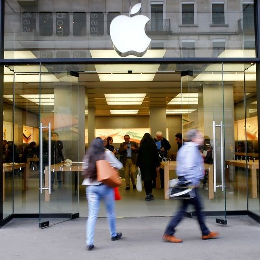
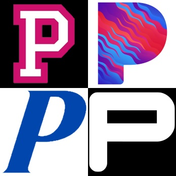
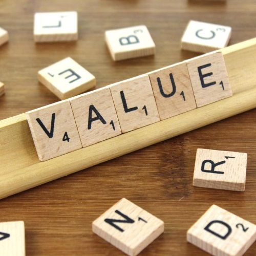

```{r setup, include=FALSE}
xaringanExtra::use_xaringan_extra(c("tile_view", 
                                    "animate_css", 
                                    "tachyons", 
                                    "scribble"))
options(htmltools.dir.version = FALSE)
```

```{cat, engine.opts=list(file = "zoom.html")}
<script src="https://lab.hakim.se/zoom-js/js/zoom.js" type="text/javascript"></script>
<script type="text/javascript">
	slideshow.on( "beforeHideSlide", function( slide ) {
		zoom.out();
	} );
	slideshow.on( "afterShowSlide", function( slide ) {
		document.querySelector( ".remark-visible" ).addEventListener( "click", function( event ) {
			event.preventDefault();
			zoom.to( {element: event.target} );
		} );
	} );
</script>
```

background-image: url("Images/Topic00Title.png")
background-size: contain
background-color: #4f2c1d
<h1 style="padding-top: 25px; padding-left: 90px; font-size: 90px; color: #ffffff; margin: 0;">Marketing Analytics</h1>
<!-- TOPIC TITLE -->
<table style="border: 0; width: 100%;">
<tr style="height: 275px;">
<td style="width: 60%;"></td><td style="width: 40%; font-size: 70px; color: #fbe5d6; line-height: 70px; vertical-align: bottom; text-align: center;">Marketing<br>Analytics<br>101</td>
</tr>
<tr style="height: 7px;"/>
<tr><td></td><td style="font-size: 70px; color: #fbe5d6; line-height: 70px;  text-align: center;">Topic 0</td>
</table>

---
class: center, middle
<table cellspacing=0 cellpadding=0 style="width: 95%; height: 80%; border: 0; border-collapse: collapse; font-size: 50px; font-weight: 400; color: #4f2c1d;">
<tr>
<td style="border-top: solid #ff7300 5px; width: 25%; vertical-align: top;" rowspan="3">Agenda</td>
<td style="border-top: solid #ff7300 5px; width: 75%; vertical-align: top; text-align: left;">Get to know each other</td>
</tr>
<tr>
<td style="border-top: solid #ff7300 5px; width: 20%; background-color: #FFECDD; vertical-align: top; text-align: left;">Where does marketing analytics fit?</td>
</tr>
<td style="border-top: solid #ff7300 5px; border-bottom: solid #ff7300 5px; width: 20%; vertical-align: top; text-align: left;">Syllabus</td>
</tr>
</table>


---
class: center

background-image: url("Images/USA-Map.png")
background-size: 60%

# Get to know your professor

--

<div class="animate__animated animate__fadeIn animate__slow">

<h2 style="position: absolute; top: 555px; left: 345px; font-style: italic;">Just a small town boy...</h2>

</div>

---

class: center

background-image: url("Images/USA-Map.png")
background-size: 60%

# Get to know your professor

<div class="animate__animated animate__fadeIn animate__slow">

<h2 style="position: absolute; top: 555px; left: 345px; font-style: italic;">Off to college...</h2>

</div>

---

class: center

background-image: url("Images/USA-Map.png")
background-size: 60%

# Get to know your professor


<div class="animate__animated animate__fadeIn animate__slow">

<h2 style="position: absolute; top: 555px; left: 345px; font-style: italic;">Get a job...</h2>

</div>

---
class: center

background-image: url("Images/USA-Map.png")
background-size: 60%

# Get to know your professor


<div class="animate__animated animate__fadeIn animate__slow">

<h2 style="position: absolute; top: 555px; left: 425px; font-style: italic;">Marketing research???</h2>

</div>

---

class: center

background-image: url("Images/USA-Map.png")
background-size: 60%

# Get to know your professor


<div class="animate__animated animate__fadeIn animate__slow">

<h2 style="position: absolute; top: 555px; left: 345px; font-style: italic;">Finally know what I want to be!</h2>
</div>

---

class: center

background-image: url("Images/USA-Map.png")
background-size: 60%

# Get to know your professor


<div class="animate__animated animate__fadeIn animate__slow">

<h2 style="position: absolute; top: 555px; left: 345px; font-style: italic;">And here I am</h2>
</div>

---

class: center

# Get to know each other


---

class: center

.pull-left[
# What is Marketing?

]

.pull-right[
.large200[
.left[<br /><br /><br />The purpose of a business is to get and keep a customer.  Without customers, no amount of engineering wizardry, clever financing, or operations expertise can keep a company going.
<br>—*Theodore Levitt*]]
]

---

class: center

.pull-left[
# What is Marketing?

]

.pull-right[
.large200[
.left[<br /><br /><br />Marketing is the activity, set of institutions, and processes for creating, communicating, delivering, and exchanging offerings that have value for customers, clients, partners, and society at large. 
]]
]

---

class: center

.pull-left[
# What is Marketing?

]

.pull-right[
.large200[
.left[<br /><br /><br />Marketing is the activity, set of institutions, and processes for <mark>creating, communicating, delivering, and exchanging offerings that have value</mark> for customers, clients, partners, and society at large. 
]]
]

---

class: center

.pull-left[
# What is Marketing?

]

.pull-right[
.large200[
.left[<br><br>
- Product<br>*What we create*
- Promotion<br>*What we communicate*
- Place<br>*How we deliver*
- Price<br>*How we exchange*
]]
]

---

class: center

.pull-left[
# What is Marketing?

]

.pull-right[
.large200[
.left[<br><br>
<span style="font-family: MathJax; font-style: italic; font-weight: bold;">value = .content-box-yellow[benefits] - .content-box-red[costs]</span>
<p style="padding-right: 180px; text-align: center; ">.content-box-yellow[Everything the<br>customer receives]</p>
<p style="padding-left: 100px; text-align: center;">.content-box-red[Everything the<br>customer gives up]</p>

- Customers are looking to maximize value

]]
]

---

background-image: url("Images/Topic00/QofM.png")
background-size: contain
background-color: #958077

---

background-image: url("Images/Topic00/Topics.png")
background-size: contain
background-color: #958077

---

background-image: url("Images/Topic00/Methods.png")
background-size: contain
background-color: #958077

---

background-image: url("Images/Topic00/MethodsTopics1.png")
background-size: contain
background-color: #958077

---

background-image: url("Images/Topic00/MethodsTopics2.png")
background-size: contain
background-color: #958077

---

background-image: url("Images/Topic00/MethodsTopics3.png")
background-size: contain
background-color: #958077
